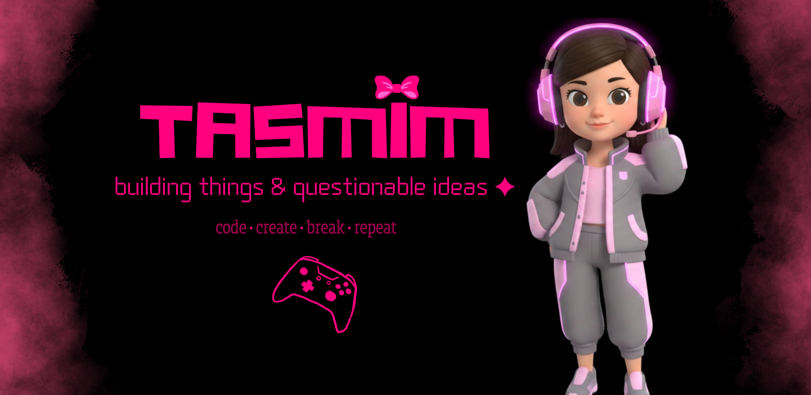
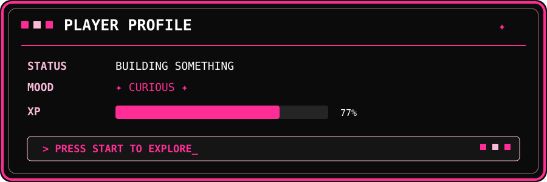

  

<h2>✦ hey, you found my little corner of the internet ✦</h2>

  🖥️ I <strong>love to code</strong>, build random ideas, and turn
   
  “what if I made this?” into something that actually exists.

  ⚡ Full-stack things &nbsp;•&nbsp;
  🧠 backend adventures &nbsp;•&nbsp;
  🎨 UI experiments &nbsp;•&nbsp;
  🤖 AI-assisted building

  Currently somewhere between
   
  <strong>building</strong> → <strong>breaking</strong> → <strong>debugging</strong> → <strong>“OH IT WORKS!”</strong>

 

<h2>💗 things that keep me busy</h2>

<table>
<tr>
<td align="center">💻 <strong>CODE</strong> build • break • rebuild</td>
<td align="center">🎮 <strong>GAMES</strong> AAA worlds & side quests</td>
<td align="center">✨ <strong>CREATE</strong> ideas → reality</td>
</tr>
</table>

 

<h2>🎮 currently in my gaming era</h2>

  🤠 <strong>Red Dead Redemption 2</strong>
   
  still one of my all-time favorites. yeehaw. 🐎

  🚗💨 <strong>GTA VI</strong>
   
  waiting patiently... very patiently... 👀

 

  <code>███████████████████░</code>
   
  loading another side quest...

 

  ✦ I write <code>code</code> for fun. ✦
   
  ✦ I build things because I can't leave an idea alone. ✦
   
  ✦ I play games when the debugging gets personal. ✦

 

