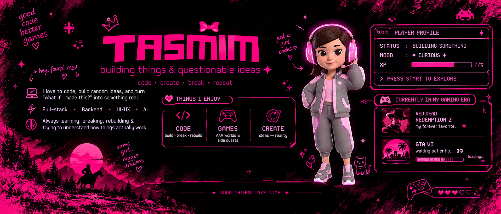

  

<h2>✦ so... what am I actually doing here?</h2>

  Somewhere between an idea, a blank editor, and way too many browser tabs,
   
  you'll probably find me building something.

  I enjoy taking an idea that exists only in my head and slowly turning it
   
  into something people can actually <strong>click, use, break, and enjoy.</strong>

  These days I'm especially into
  <code>full-stack development</code>,
  <code>backend engineering</code>,
  <code>Java / Spring Boot</code>,
  and figuring out what makes software tick under the hood.

 

<h2>🧠 the part of coding I actually love</h2>

  It's not just writing code.
   
  It's the moment when a messy problem suddenly becomes
  <strong>"wait... I know how to solve this."</strong>

  I like learning by building, going down rabbit holes,
   
  understanding why something works, breaking it,
   
  fixing it, and then realizing I accidentally learned five new things.

  <code>curiosity → rabbit hole → experiment → bug → fix → XP gained ✦</code>

 

<h2>🎮 side quests are important too</h2>

  When I'm not fighting bugs, I'm probably fighting fictional problems
   
  in a completely different universe.

  🤠 <strong>Red Dead Redemption 2</strong> - currently riding through the wild west.
   
  🚗💨 <strong>GTA VI</strong> - patiently waiting for the next big side quest.

  I love AAA games for the same reason I love building software:
   
  <strong>someone imagined an entire world, then actually built it.</strong>

 

<h2>🌙 currently somewhere between...</h2>

  <code>shipping something</code>
  &nbsp;•&nbsp;
  <code>learning something</code>
  &nbsp;•&nbsp;
  <code>playing something</code>

  And occasionally staring at my code for 20 minutes wondering
   
  why it worked five minutes ago.

 

  ✦ <strong>build curious.</strong>
  &nbsp;
  ✦ <strong>play often.</strong>
  &nbsp;
  ✦ <strong>keep exploring.</strong>

 

